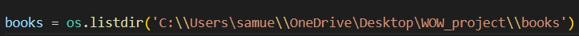

# Who Owns Whom Project
Text scraping to identify parent companies and subsidiaries in given books (text files), and transferring data into ```.xlsx``` files, using ```python``` and various packages and following rules 

# Steps

### System Prerequisites
- Python version 3.10, (pip should be installed together)
- git 

## 1. Cloning from Github
This step will allow you to clone this repository from github onto your local machine and run it 

1. First download git [here](https://git-scm.com/download/)
2. Clone this repository from github by running ```git clone https://github.com/sd-20/WOW_project.git``` inside your terminal in the desired parent directory

## 2. Installing Python Virtual Environment and Packages

This will allow you to install necessary packages and keep them contained in this directory
1. Make sure you are in the project directory ```WOW_project```
1. Run `python -m venv venv` in the directory of the project to install the virtual environment
2. Then, activate the environment by running ```source venv/bin/activate``` (Mac) or ```venv\Scripts\Activate.ps1``` (Windows)
3. Install dependant packages using ```pip install -r requirements.txt```
4. Create a folder called `books` to put the text files you wish to run the script on
5. Create a folder called `spreadsheets` which will be the output `.xlsx.` files from the script 

### Modifications Before You Run
1. The way the code in `main.py` works is it will go into `books` and scrape each file, outputting an `.xlsx` of the same name in `spreadsheets`
2. However, you must replace the url at line `8` in `main.py` with the path of `books` on your machine, note the double slashes to escape the special characters liek ```/O```and ```/b```


  

## 3. How to Run the Script
1. Open command prompt (windows) or terminal (mac) and navigate to the project directory
2. activate the virtual environment as explained [here](#system-prerequisites)

3. type  ```python3 main.py```
4. Alternatively, you can simply run ```main.py``` through a code editor like VS Code 
5. When you are done you can close the virtual environment by typing ```deactivate```

## 3. Results
1. Navigate to `spreadsheets`
2. Open ```{book_name.txt}.xlsx``` in a spreadsheet editor to see results
